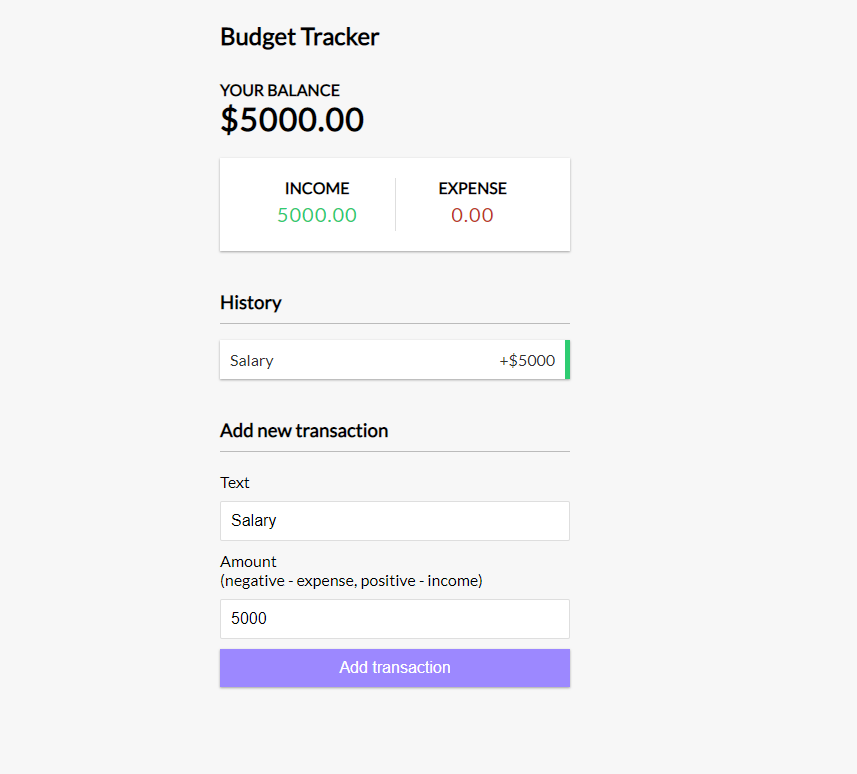
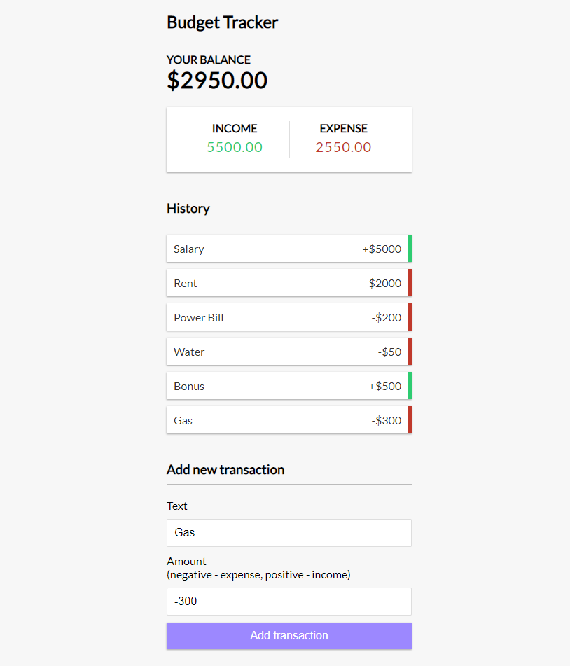

# Budget Tracker
     

---

## Description:
This is a React application that allows a user to manage their income as well as expenses. The user can input the name of income/expense as well as its dollar amount, and then view the balance. Expenses are distinguished from income by adding a (-) minus sign before the expense amount. This Budget Tracker also uses _LocalStorage_ to store the user's expenses so that they can be viewed again later. See the [usage](#usage) or [demonstration](#demonstration) sections for a more detailed explanation on how to use this application.

This application was created using _ReactJS_, as well as _React Hooks_ (_useState_ and _useEffect_), and LocalStorage.

---

## Table of Contents:
* [Installation](#installation)
* [Usage](#usage)
* [Demonstration](#demonstration)
* [License](#license)
* [Resources](#resources)
* [Future Improvements](#future-improvements)

---

## Installation:
None is required.

---

## Usage:
To use the application, go to __[this link](https://5f17492f6d310b8a847513c7--goofy-noyce-14c125.netlify.app/)__.

Steps to use this application:
* __step 1:__ Input information about the income (name/type, and amount) and click the "Add Transaction" button.

* __step 2:__ Input information about the expense (name/type, and amount) and click the "Add Transaction" button.

* __step 3:__ Keep adding transactions. The list and balance will persist even if the page is closed/re-opened or refreshed.

---

## Demonstration:
To view a demonstration of this application, go to __[this link](https://5f17492f6d310b8a847513c7--goofy-noyce-14c125.netlify.app/)__.

---

## License:
[MIT License](https://opensource.org/licenses/MIT)

Copyright © 2020 Paul Wachira

Permission is hereby granted, free of charge, to any person obtaining a copy
of this software and associated documentation files (the "Software"), to deal
in the Software without restriction, including without limitation the rights
to use, copy, modify, merge, publish, distribute, sublicense, and/or sell
copies of the Software, and to permit persons to whom the Software is
furnished to do so, subject to the following conditions:

The above copyright notice and this permission notice shall be included in all
copies or substantial portions of the Software.

THE SOFTWARE IS PROVIDED "AS IS", WITHOUT WARRANTY OF ANY KIND, EXPRESS OR
IMPLIED, INCLUDING BUT NOT LIMITED TO THE WARRANTIES OF MERCHANTABILITY,
FITNESS FOR A PARTICULAR PURPOSE AND NONINFRINGEMENT. IN NO EVENT SHALL THE
AUTHORS OR COPYRIGHT HOLDERS BE LIABLE FOR ANY CLAIM, DAMAGES OR OTHER
LIABILITY, WHETHER IN AN ACTION OF CONTRACT, TORT OR OTHERWISE, ARISING FROM,
OUT OF OR IN CONNECTION WITH THE SOFTWARE OR THE USE OR OTHER DEALINGS IN THE
SOFTWARE.

---

## Resources:
* [ReactJS](https://reactjs.org/docs/getting-started.html)
  * [React Hooks](https://reactjs.org/docs/hooks-intro.html)
    - [useState](https://reactjs.org/docs/hooks-state.html)
    - [useEffect](https://reactjs.org/docs/hooks-effect.html)

---

## Future Improvements:
* Break down components further (ie, for each of the section headers, buttons, etc).
* Clear transactions from the input after user clicks "Add Transaction".
* Use a database such as MongoDB.

---
